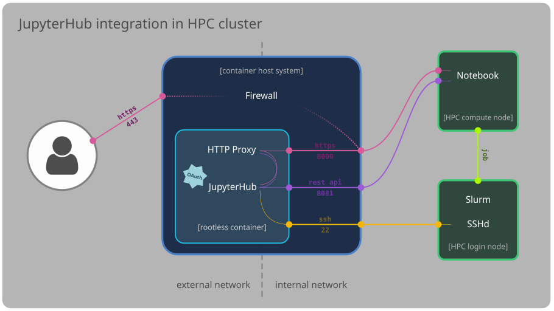

# JupyterHub

The hub and its HTTP proxy are run by a non-root user in a rootless container.
The container is managed in the host systems by a service in
[systemd](https://systemd.io/) with [podman](https://podman.io/).

Notebooks are launched remotely, on the compute nodes of our HPC cluster.
The allocation of hardware resources for the notebook is done on-demand by
the resource manager [Slurm](https://slurm.schedmd.com/). Users can select the
resources for their notebooks from the JupyterHub interface thanks to the
[JupyterHub MOdular Slurm Spawner](https://github.com/silx-kit/jupyterhub_moss),
which leverages [batchspawner](https://github.com/jupyterhub/batchspawner) to
submit jobs to Slurm in user's behalf that will launch the single-user server.

The main particularity of our setup is that such jobs are not submitted to
Slurm from the host running JupyterHub, but from the login nodes of the HPC
cluster via an SSH connection. This approach has the advantage that the system
running JupyterHub can be very minimal, avoiding the need for local users,
special file-system mounts and the complexity of provisioning a Slurm
installation capable of submitting jobs to the HPC cluster.

## Rootless

JupyterHub is run by a non-root user in a rootless container. Setting up a
rootless container is well described in the [podman rootless
tutorial](https://github.com/containers/podman/blob/main/docs/tutorials/rootless_tutorial.md).

We use a [system service](host/etc/systemd/system/jupyterhub.service) to
execute `podman` by a non-root user `jupyterhub` (*aka* JupyterHub operator).
This service relies on a [custom shell script](host/usr/local/bin/jupyterhub-init.sh)
to automatically initialize a new image of the rootless container or start an
existing one.

The container [binds a few mounts with sensitive configuration
files](host/usr/local/bin/jupyterhub-init.sh#L59-L66) for JupyterHub, SSL
certificates for the web server and SSH keys to connect to the login nodes.
Provisioning these files in the container through bind-mounts allows to have
secret-free container images and seamlessly deploy updates to the configuration
of the hub.

## Network

The network setup for JupyterHub is rather simple. Rootless containers do not
have a routable IP address, so they rely on the network interfaces of the host
system. The hub must be able to talk to the notebooks being executed on the
compute nodes in the internal network, as well as serve the HTTPS requests
(through its proxy) from users on the external network. Therefore, ports 8000
(HTTP proxy) and 8081 (REST API) in the [container are forwarded to the host
system](host/usr/local/bin/jupyterhub-init.sh#L53-L57).

The firewall on the host systems blocks all connection through the external
network interface and forwards port 8000 on the internal interface (HTTP proxy)
to port 443 on the external one. This setup renders the web interface of the
hub/notebooks accessible from both the internal and external networks. The REST API
of the hub is only available on port 8081 of the internal network.

## Authentication

User authentication is handled through delegation via the
[OAuth](https://en.wikipedia.org/wiki/OAuth) service of the
[VSC](https://www.vscentrum.be/) accounts used by our users.

We use the [GenericOAuthenticator](https://github.com/jupyterhub/oauthenticator/)
from JupyterHub:

* carry out a standard OAuth delegation with the VSC account page

    * [URLs of the VSC OAuth](container/Dockerfile#L72-L76) are defined in the
      environment of the container

    * [OAuth secrets](container/.config/jupyterhub_config.py#L40-L45) are
      defined in JupyterHub's configuration file

* local users beyond the non-root user running JupyterHub are **not needed**

## Slurm

Integration with Slurm is leveraged through a custom Spawner called
[VSCSlurmSpawner](container/.config/jupyterhub_config.py#L60) based on
[MOSlurmSpawner](https://github.com/silx-kit/jupyterhub_moss).
`VSCSlurmSpawner` allows JupyterHub to generate the user's environment needed
to spawn its single-user server without any local users. All user settings are
taken from `vsc-config`.

We modified the [submission command](container/.config/jupyterhub_config.py#L295)
to execute `sbatch` in the login nodes of the HPC cluster through SSH.
The login nodes already run Slurm and are the sole systems handling job
submission in our cluster. Delegating job submission to them avoids having to
install and configure Slurm in the container running JupyterHub. The hub
environment is passed over SSH with a strict control over the variables that
are [sent](container/.ssh/config) and [accepted](slurm_login/etc/ssh/sshd_config)
on both ends.

The SSH connection is established by the non-root user running JupyterHub (the
hub container does not have other local users). This jupyterhub user has
special `sudo` permissions on the login nodes to submit jobs to Slurm as other
users. The specific group of users and list of commands allowed to the
jupyterhub user are defined in the [sudoers file](slurm_login/etc/sudoers).

Single-user server spawn process:

1. user selects computational resources for the notebook in the
   [web interface of the hub](https://github.com/silx-kit/jupyterhub_moss)

2. `VSCSlurmSpawner` generates environment for the user without any local users
   in the system of the hub

3. jupyterhub user connects to login node with SSH, environment is passed
   through the wire

4. jupyterhub user submits new job to Slurm cluster as target user keeping the
   hub environment

5. single-user server job script fully [resets the
   environment](container/.config/jupyterhub_config.py#L264-L285) before any
   other step is taken to minimize tampering from user's own environment

6. single-user server is launched **without** the mediation of `srun` to be
   able to use software relying on MPI as *srun-in-srun* is not possible

